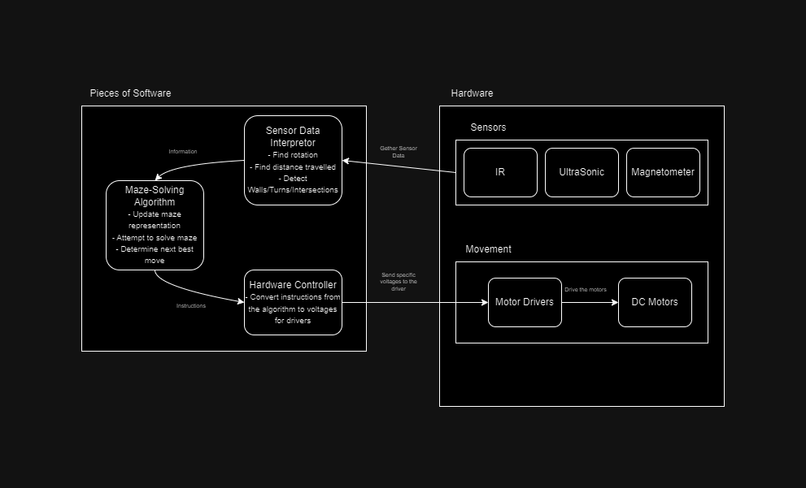
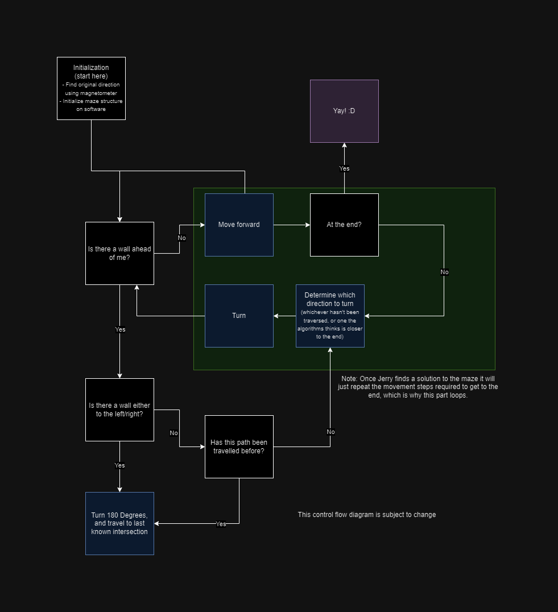

# Jerry

## Overview

We're naming our MicroMouse Jerry, from Tom and Jerry. There's going to be a single program running on the Arduino (the micro-controller we chose), that will both control the hardware and run the algorithm that attempts to solve the maze. We're going with a combination of IR and ultrasonic sensors, and a compass for Jerry's perception. The 2 IR sensors will be facing left and right, while the ultrasonic sensor will face ahead. The ultrasonic sensor will be used as a way to localize Jerry (more detail below). The compass will be used for finding orientation. And the IR sensors to detect walls and to keep Jerry from running into a wall. The Arduino runs at 6 MHz, which should be fast enough to process information from all 4 sensors while being able to give Jerry instructions for movement at at least 50 Hz. We'll going to do some testing to make sure the Arduino is capable. The algorithm won't be running all the time, only when Jerry has stopped at an intersection, so it shouldn't matter too much in terms of being able to be run fast enough by the Arduino.

### Software Plan

We'll be using C++ for both controlling Jerry and for the algorithm. We chose C++ due to how resource efficient it is, its speed, and because 2 of our team members have prior experience programming with it. We'll be using mostly standard libraries (cmath, chrono, etc) to program the algorithm, and PlatformIO for writing the Arduino code along with any libraries that individual components require (see below in hardware plan). Since the Arduino can only run one program at a time, both the hardware controlling software and the maze-solving algorithm would have to be in the same program. We're planning on creating a custom data structure that would representing the maze. It will probably be something similar to a 2D Array of "Cells", where each cell is just 4 bits (each bit to represent whether the north, south, east, west sides of that Cell are open or is a wall). We'll try to calculate the distance travelled by Jerry using the ultrasonic sensor to figure out which "cell" Jerry is currently in, we know the general dimensions for the maze.
As for the maze solving algorithm, we're planning on using the Flood Fill algorithm, like many other teams. We're going with this because it's the most reliable, [the most efficient](https://swati-mishra.com/wp-content/uploads/2020/02/04725791.pdf) given the time constraint, and also one that is well documented so it won't be too hard to implement. And I've already brainstormed an implementation that will work with the data structure of the maze that we'll be using (the one mentioned above).

### Hardware Plan

We're using an Arduino Uno to control Jerry due to it's low power consumption. And we probably won't be utilizing any of the extra features of a Raspberry Pi or more advanced micro controller. Jerry will use a total of 4 wheels, each with its own DC motor to move around the maze. We want to use the IR sensors to make sure Jerry isn't going to run into a wall by comparing the values received from each sensor and adjusting Jerry's movement to get each of the sensor readings as similar as possible (if the sensors readings are greatly different, that means that Jerry is either closer to one side of a wall than the other, or if the difference between the readings are big enough it means that there isn't even a wall on one of/both the sides). The ultrasonic sensor will be used to find the distance travelled by Jerry by comparing Jerry's distance from the wall in front before and after Jerry starts moving. The front facing sensor is the ultrasonic sensor since ultrasonic sensors are more reliable and the front facing sensor is the only sensor that will be used to find the distance travelled. We'll be using the magnetometer as a compass to make turns more accurately. For the motors, we decided to use the 3777 gear motor since gear motors have higher torque while sacrificing RPM. But Jerry shouldn't be moving super fast anyways since it has to process the maze, make decisions, turn, etc, so it'll be moving pretty slowly. And rotating the motors with Jerry's weight is more important. The motors also need a driver because the voltage needed is really high (12V), and for that we chose the L9110H, which has the voltage range and max current sufficient for the 3777s.
We're planning on using a very small breadboard to connect everything together, but if we have the time near the end of the project we might try to create a custom PCB.

Parts:
- Each IR Sensor - Adafruit VL6180X:
	- Power/Electric:
		- Operating range (optimal): 2.7V to 2.9V
		- Power Consumption (typical average): 1.7mA
	- Connection Type: I2C
	- Input/Data Output: N/A (Uses the Adafruit_VL6180X library for getting output)
- Ultrasonic Sensor - Adafruit HC-SR04:
	- Power/Electric:
		- Operating range: 5V
		- Power Consumption: 15mA
	- Connection Type: Just 2 pins other than VCC/GND, trigger and echo
	- Input/Data Output: Pulse length (divide by 58 for distance detected in centimeters)
- Magnetometer (compass) - Adafruit MMC5603:
	- Power/Electric:
		- Operating Range: 3V (Has voltage regulator so will accept from 3V to 5V)
		- Power Consumption: 4mA
	- Connection Type: I2C
	- Input/Data Output: N/A (Uses the Adafruit_MMC56x3 library for getting output)
- Arduino - Uno R4 Minima:
	- Power/Electric:
		- Operating Range: 5V (Will accept from 6V to 24V)
		- Power Consumption: 8mA per I/O pin
	- Connection Type: N/A (This is the microcontroller, so it will just connect to the other components using its onboard pins)
	- Input/Data Output: N/A
- DC Motors - Adafruit 3777:
	- Power/Electric:
		- Operating Range: 3V to 6V
		- Power Consumption: 150mA to 160mA
	- Connection Type: VCC/GND pins
	- Input/Data Output: N/A
- DC Motor Driver - Adafruit L9110H:
	- Power/Electric:
		- Operating Range: 2.5V to 12V
		- Power Consumption: Upto 800mA
	- Connection Type: 2 Half Bridges (each with VCC/GND, and Input/Output pins)
	- Input/Data Output: N/A
## Flowcharts / Diagrams

### Systems Design

## Parts and Costs

### Purchases

| Item Name w/Link | Cost per Unit | # of Units | Total Cost |
| ---- | ---------------- | ---- | ---------------- |
| [ARDUINO UNO R4 MINIMA](https://www.digikey.com/en/products/detail/arduino/ABX00080/20371542) | $20.00 | 1 | $20.00 |
| [HC-SR04 Ultrasonic Distance Sensor](https://www.adafruit.com/product/3942) | $3.95 | 1 | $3.95 |
| [VL6180X IR Distance Sensor (Time Of Flight)](https://www.adafruit.com/product/3316) | $13.95 | 2 | $27.90 |
| [MMC5603 Triple-Axis Magnetometer](https://www.adafruit.com/product/5579) | $5.95 | 1 | $5.95 |
| [USB Li-Ion Power Bank with 2 x 5V Outputs @ 2.1A - 5000mAh](https://www.adafruit.com/product/4288) | $26.95 | 1 | $26.95 |
| [3777 Adafruit DC 200RPM 3V-6V](https://www.digikey.com/en/products/detail/adafruit-industries-llc/3777/8687221) | $2.95 | 4 | $11.80 |
| [L9110H H-Bridge Motor Driver 2.5V-12V](https://www.adafruit.com/product/4489) | $1.50 | 4 | $6.00 |
| | | **Total** | **$108.45** |

### Custom Creation

1. 3D Printed Parts:
	1. Chassis
	2. Wheels
2. Custom PCB (Maybe, if there is time in the end)

### Parts on Hand

1. Wires
2. Breadboard

## 3D Model

This should be a series of images from multiple angles of a to scale model of your robot that includes all major physical components (small components such as fundamental circuit components and wires can be omitted). You may use whatever method of creating this model as long as it is to scale. We recommend using 3D CAD programs such as Autodesk Inventor or Fusion 360. You may also use physical prototyping methods such as foam-core, cardboard, clay, or even Lego. The most important thing is that you get a real-world representation of the actual size of your components in relation to each other. As such, this model does not need to be detailed, as long as the size and shape of parts are correct. 

## Teammates and Responsibilities

### Tanvir Jawad

Implementing the maze solving algorithm, interpreting the data from the sensors, constructing/updating Jerry's maze representation accordingly.
### Bry Morocho    

Writing the "drivers" for the Jerry's movement (the code that will tell Jerry how much/fast to rotate each of its motors), and writing the software that will get the output from each of the sensors.
### Eric Padron

Wiring the hardware and all the parts together, modelling the chassis + 3D printing, and also writing the movement "drivers" for Jerry.
## Milestones

### Milestone Set 1: 11/11/23

* Finalize the chassis design for Jerry
* Have a general idea of the math required to interpret the data from the different sensors
* Fully work out how to implement the Flood Fill algo with our data structure (on a high level, programming not necessary)

### Milestone Set 2: 11/25/23
* Wire up the motors to the drivers and Arduino (simple make motors spin)
* Be able to read IR sensor data

### Milestone Set 3: 12/9/23
* Finish the Flood Fill algorithm implementation of our maze data structure (test on hard-coded mazes) 
* Be able to read ultrasonic sensor
* Test the math for the IR sensors

### Milestone Set 4: 1/13/24
* Optimize Flood Fill algorithm
* IR sensor data is successfully used to keep Jerry straight and prevent it from bumping into walls
* The distance Jerry travels can be measured accurately enough to localize Jerry's location in the maze

### Milestone Set 5: 1/20/24
* Jerry can traverse a maze while successfully updating the maze data structure
### Milestone Set 6: 1/27/24
* Jerry can solve a given maze

### Milestone Set 7: 2/10/24
* Time improvements with solving a maze
* Adjust motor speeds, use more advanced for better precision, whatever needs to be done
* Final touches
